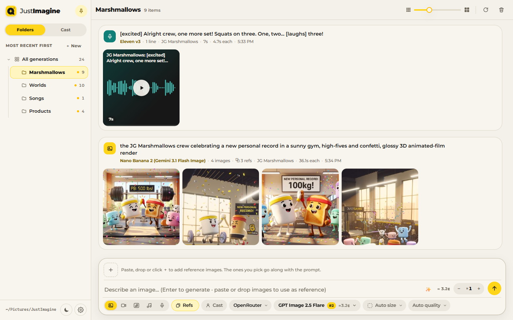
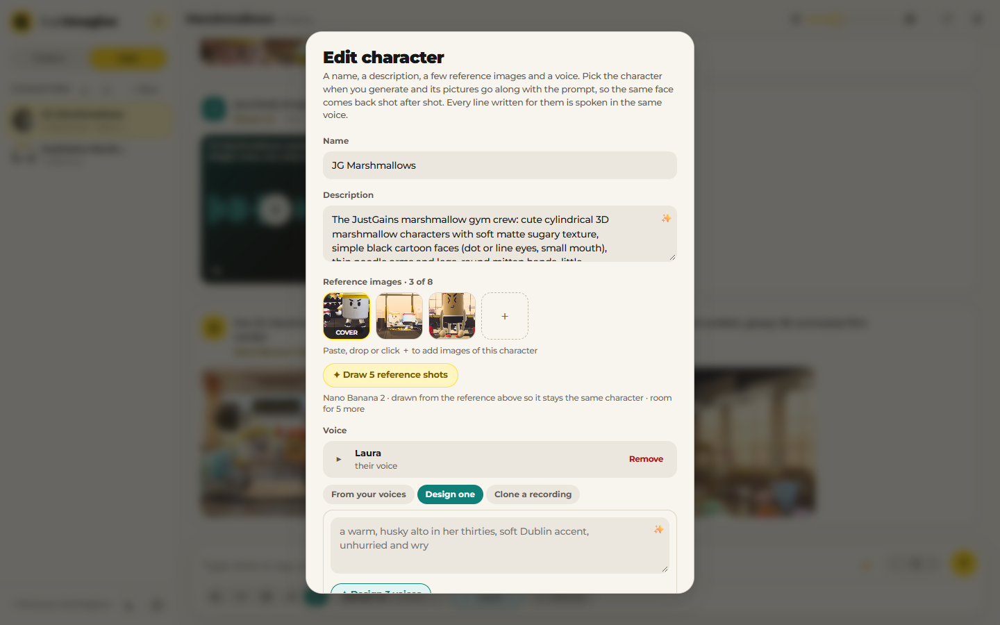
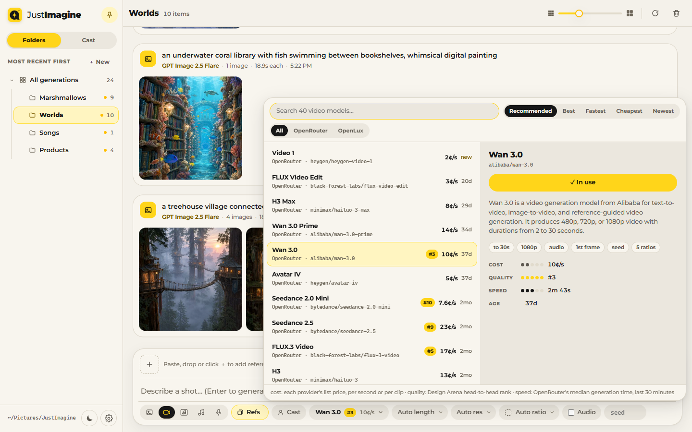
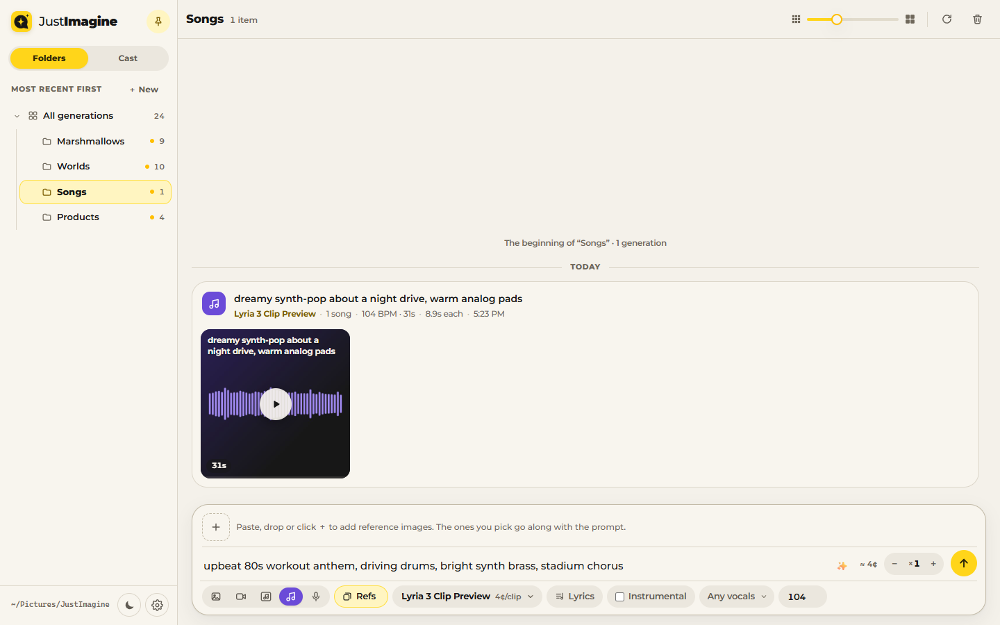
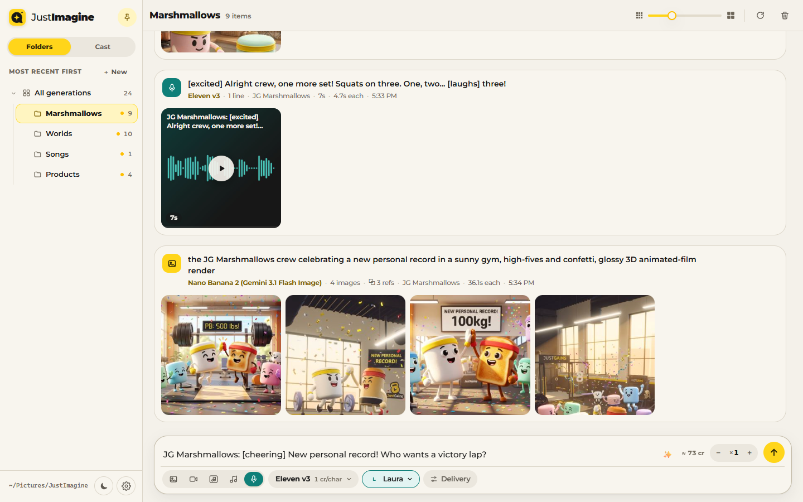
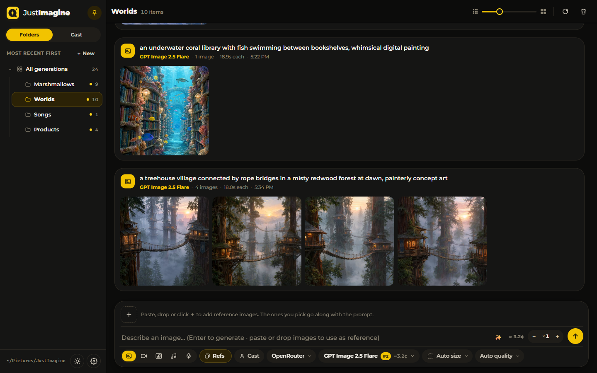

# JustImagine

**Make images, videos, songs and voice lines from one local web app.**
Everything you make is kept in folders on your own disk. You can save characters
and reuse them, and each one can have its own voice. There is also a JSON API for
scripts and agents.



| Make | Runs on | Key you need |
| --- | --- | --- |
| 🖼️ **Images** | OpenRouter (GPT Image, Nano Banana, FLUX…) or any OpenAI-style image API | `OPENROUTER_API_KEY` |
| 🎬 **Video** | OpenRouter and OpenLux (Veo, Sora, Kling, Seedance, Wan, Hailuo…) | `OPENROUTER_API_KEY` |
| 🎵 **Songs** | Google Lyria 3 on OpenRouter: 30-second clips or full songs | `OPENROUTER_API_KEY` |
| 🎙️ **Voices** | ElevenLabs: single lines or multi-character scenes | `ELEVENLABS_API_KEY` |
| 🎤 **Music videos** | A song plus a performer, lip-synced shot by shot (Kling, Seedance) | `OPENROUTER_API_KEY` or an OpenLux key |

## Quick start

You need **Node.js 18 or newer**. There are no dependencies to install.

```sh
git clone https://github.com/JustGains/JustImagine.git
cd JustImagine
export OPENROUTER_API_KEY=sk-or-...      # images, video and songs
export ELEVENLABS_API_KEY=...            # voices (optional)
npm start
```

The gallery opens in your browser. You can also paste keys later under
**Settings** (⚙ at the bottom left).

Useful options:

```sh
npm start -- -p openrouter          # skip the provider menu
npm start -- --root ./my-gallery    # keep generations in a different folder
npm start -- --port 8790            # use a fixed port
npm start -- --help                 # every option
```

## A tour

### Characters that stay the same shot after shot

Save a character with a few reference images and a voice. Pick them when you
generate, and their pictures go along with the prompt, so the same face comes
back each time. You can pick a voice from your ElevenLabs library, design a
new one from a description, or clone one from a recording.



### Choose a model by cost, quality and speed

Each model shows its price, its quality rank and how fast it has been. The
controls change to match each model, so you can only pick settings it
supports, like duration, resolution, aspect ratio and audio.



### Songs

Describe the style, then write lyrics or let ✨ write them. Choose the vocals,
tempo and length, or make it instrumental.



### Voices and scenes

Type a line, or write a scene where each line starts with a character's name
(`Nora: Where were you?`). Eleven v3 performs the scene as one take, and each
character speaks in their own voice.



### Light and dark



## Configuration

| What | Where |
| --- | --- |
| Provider keys | **Settings** in the app, `~/.justimagine/config.json`, or the environment (`OPENROUTER_API_KEY`, `ELEVENLABS_API_KEY`) |
| Your generations | `.justimagine/` in the folder you start from (change it with `--root`) |
| Characters | `~/.justimagine/characters/` |
| API token | `~/.justimagine/auth.token` |
| A different home folder | `JUSTIMAGINE_HOME=/path` (or `JUSTIMAGINE_CONFIG_PATH` for just the config file) |

The app only picks up keys set in the environment when it starts. Restart it
after you change them.

## Use it from code

Every button in the app is also an API call. Send the token from
`~/.justimagine/auth.token` as `Authorization: Bearer <token>`:

```sh
TOKEN=$(cat ~/.justimagine/auth.token)
curl -s http://127.0.0.1:<port>/api/generate \
  -H "Authorization: Bearer $TOKEN" -H "content-type: application/json" \
  -d '{"kind":"image","prompt":"a lighthouse in a storm","count":4,"wait":120}'
```

`kind` can be `image`, `video`, `song` or `voice`. See the
**[API reference](docs/justimagine-api.md)** for every route: batches, jobs,
live events, characters, voices and uploads.

## Run it in the background

```sh
node bin/justimagine.js service install   # start at every login, on port 8793
node bin/justimagine.js service status
node bin/justimagine.js service stop
node bin/justimagine.js open              # open the running gallery
```

## Docs

- [API reference](docs/justimagine-api.md): every route, with examples
- [Music video mode](docs/music-video.md): a portrait, a few lyric lines and a style become a singing clip
- [Full-song music videos](docs/music-video-full-song.md): a whole song, lip-synced shot by shot

## Development

```sh
npm test            # bun test ./src
npm run check       # syntax check the entry points
npm pack --dry-run  # see what ships
```

Tests use [Bun](https://bun.sh). The app itself only needs Node.

<details>
<summary><b>Using JustImagine inside another app</b> (Bro-CLI, TekPrepperAI)</summary>

This package owns the shared server, UI, generation pipeline, storage, CLI and
tests. Bro-CLI and TekPrepperAI use it as a
dependency. Import it by package name, not by paths into `src`:
`@justsuperhuman/justimagine`, plus `/cli`, `/server`, `/auth`, `/generation`,
`/audio`, `/music-video`, `/music-video-plan`, `/store`, `/characters`, `/models`,
`/openlux` and `/ui`.

For local development, check the repos out side by side:

```text
F:/JustImagine
F:/TekPrepperAI
F:/bro-cli
```

Both hosts depend on `"@justsuperhuman/justimagine": "file:../JustImagine"`.
Run `npm install` in each host to link this checkout. Changes here then show up
in either host after you restart it.

- **Bro** supplies its own config, catalogues, terminal UI, `.bro/justimagine`
  gallery, global cast and OS service. Its server listens only on the local
  machine, on port 8791, and needs no sign-in.
- **TekPrepperAI** owns accounts, roles, sessions and Website Studio. It wraps
  the app in its account guard, turns off reading files from the server's disk,
  and gives each account its own keys and data folders. Build its container
  with `docker build --build-context justimagine=../JustImagine -t tekprepper-ai .`
- **Standalone** JustImagine signs in with a token.

The background service keeps its old `TekPrepper-JustImagine` task names, so
existing installs keep working.

</details>

## License

MIT. See [LICENSE](LICENSE).
